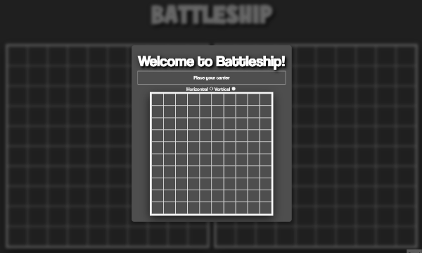

# Battleship Game

A web-based version of the classic Battleship game, built with JavaScript, HTML, CSS, and Webpack. The game features modular classes for the player, AI, gameboard, and ships with clean separation of concerns and includes basic AI logic for computer opponent ship placement and attacks.

## 📸 Screenshots



## 🎯 Features

- Dynamic ship placement with validation (no overlaps or out-of-bounds)
- Player vs. Computer gameplay with turn-based mechanics
- Computer AI that places ships randomly with retry logic and avoids duplicate attacks
- Attack tracking with hit/miss feedback
- Victory detection based on sunk ships
- Modular JavaScript structure using ES6 classes and Webpack
- Unit testing with Jest for game logic

## 🧰 Tech Stack

- HTML5 / CSS3
- JavaScript (ES6 Classes & Modules)
- Webpack
- Jest (unit testing)

## 🚀 Live Demo

👉 [Play Battleship](https://Blakem07.github.io/battleship-game/)

## 🛠️ Installation & Setup

```bash
git clone https://github.com/Blakem07/battleship.git
cd battleship
npm install
```

## 💻 Running the Project

To start the development server and run tests simultaneously:

```bash
npm run dev
```

## 📦 Project Structure Overview

- **Ship**: Represents individual ships, tracks hits and sunk status.
- **Gameboard**: Manages 10x10 grid, ship placement, attack resolution, and board state.
- **Player**: Encapsulates gameboard, handles attacking and ship placement interfaces.
- **Computer**: AI controller for ship placement and attacks with retry logic and attack memory.
