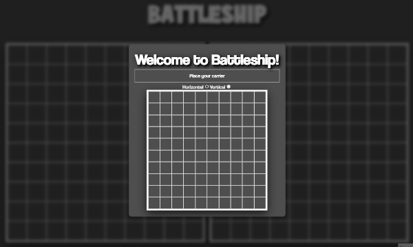

# Battleship Game

A browser-based implementation of Battleship focused on JavaScript fundamentals, modular design, and unit-tested game logic.

## Summary

- Modular ES6 class architecture using `Ship`, `Gameboard`, `Player`, `Computer`, `GameController`, and `UI`
- Validated ship placement with overlap and out-of-bounds prevention
- Turn-based player vs computer gameplay
- Hit, miss, sunk-ship, and victory-state tracking
- Duplicate-attack prevention for both player and computer actions
- Basic computer opponent logic with randomized placement, attack selection, retry logic, and attack memory
- Webpack-based build setup
- Jest unit tests covering core game behaviour

## Demo



## Technical Highlights

### Modular JavaScript Architecture

The project separates core game rules from DOM interaction. Game entities are modelled with ES6 classes, keeping placement, attack resolution, player behaviour, and UI updates easier to test and reason about.

### Ship Placement Validation

`Gameboard` validates ship placement before updating board state, preventing overlapping ships and out-of-bounds placement.

### Attack Tracking

`receiveAttack` records hit and miss outcomes, updates ship state, prevents duplicate attacks, and supports victory detection when all ships are sunk.

### Computer Behaviour

The computer opponent uses randomized ship placement and attack selection, with retry logic and memory of previous attacks to avoid duplicate moves.

### Testing

Jest tests cover constructors, ship placement, attack resolution, duplicate attack handling, computer behaviour, and controller flow.

## Tech Stack

- JavaScript
- HTML5
- CSS3
- Webpack
- Jest
- Babel

## Installation

```bash
git clone https://github.com/Blakem07/battleship-game.git
cd battleship-game
npm install
```

## Development

Start the development server:

```bash
npm run start
```

Run tests:

```bash
npm test
```

## Repository Structure

```text
.
├── assets/                 Static project assets
├── dist/                   Production build output
├── src/
│   ├── classes/            Core game modules
│   │   ├── Ship.js         Ship state, hits, and sunk status
│   │   ├── Gameboard.js    Grid state, placement validation, and attack handling
│   │   ├── Player.js       Human player model
│   │   ├── Computer.js     Computer opponent behaviour
│   │   ├── GameController.js
│   │   ├── UI.js           DOM interaction and rendering
│   │   ├── constants.js
│   │   └── index.js
│   ├── font/               Font assets
│   ├── img/                Image assets
│   ├── tests/              Jest test suites
│   ├── App.js              Application setup
│   ├── index.js            Entry point
│   ├── styles.css          Global styles
│   └── css-reset.css       CSS reset
├── template.html           HTML template
├── webpack.config.mjs      Webpack configuration
├── jest.config.js          Jest configuration
├── babel.config.js         Babel configuration
└── package.json            Scripts and dependencies
```

## Purpose

This project demonstrates modular JavaScript design, object-oriented programming, state management, DOM interaction, and unit testing without relying on a front-end framework.
